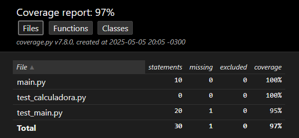

# 🧪 Projeto de Testes com Python `unittest`

Este repositório foi criado para estudar e aplicar testes automatizados em Python usando a biblioteca `unittest`, além de acompanhar a cobertura de código com `coverage` e integrar testes automáticos com o GitHub Actions.

---

## 📚 Sobre o Projeto

Este projeto contém funções simples (como somar e dividir) que são testadas usando a biblioteca de testes `unittest`.

Objetivos principais:

- Aprender como funciona o `unittest`
- Aplicar testes de unidade em Python
- Medir cobertura de testes com `coverage`
- Automatizar testes com GitHub Actions
- Publicar o projeto completo no GitHub

---

## 📁 Estrutura do Projeto

```
unittest-project/
├── main.py                 # Código com as funções principais
├── test_main.py           # Arquivo com os testes unitários
├── README.md              # Este arquivo de documentação
├── coverage_result.png    # Print com o resultado da cobertura
└── .github/
    └── workflows/
        └── python-unittest.yml  # Configuração do GitHub Actions
```

---


## 🧪 Como Executar os Testes

### 1. Rodar os testes:

```bash
python test_main.py
```

### 2. Gerar cobertura com `coverage`:

```bash
coverage run -m unittest discover
coverage report
coverage html
```

Depois, abra o arquivo `htmlcov/index.html` no navegador para ver o relatório visual.

---

## 📊 Resultado da Cobertura de Testes

Abaixo está o print gerado com o resultado da cobertura:



---

## 🤖 GitHub Actions

Sempre que um novo código for enviado para o repositório, os testes são executados automaticamente.

---

## 🧰 Ferramentas Utilizadas

- `unittest`: biblioteca padrão para testes unitários em Python
- `coverage`: ferramenta que mostra quanto do código foi testado
- `Git`: sistema de controle de versão
- `GitHub`: plataforma para versionamento e hospedagem do projeto
- `GitHub Actions`: automação de testes sempre que há mudanças no código

---

## 🚀 Como Clonar e Rodar

```bash
git clone https://github.com/seu-usuario/unittest-project.git
cd unittest-project
python test_main.py
```

> Substitua `seu-usuario` pelo seu nome de usuário no GitHub.

---

## ✨ Contribuição

Este projeto foi feito com fins educacionais. Fique à vontade para contribuir com melhorias, testes adicionais ou feedback.

